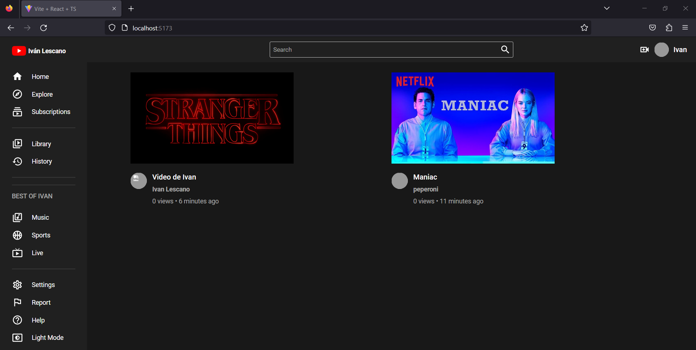
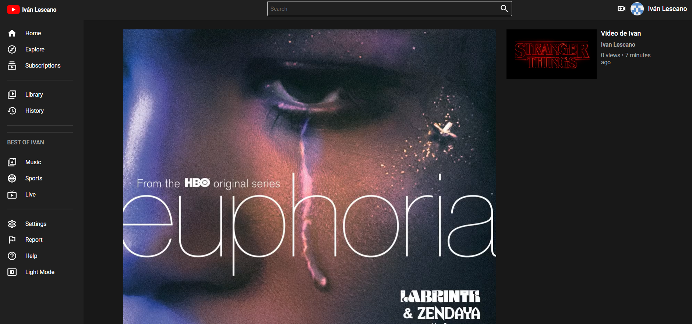

# clone-youtube

Es una aplicación clone de YouTube con MongoDB

# Backend
Aplicacion con vite, typescript y como base de datos mongodb ATLAS
### Tecnologías

- [x] Aplicacion con vite
- [x] TypeScript
- [x] Mongoose
- [x] Node
- [x] pnpm 

## Variables de Entorno
Despues de clonar el proyecto debemos crear un archivo .env  en donde definiremos las siguientes variables de entorno 
- PORT= 4000

# Frontend

### Tecnologías

- [x] Aplicacion con vite
- [x] TypeScript
- [x] React js
- [x] Redux Toolkit
- [x] Node
- [x] pnpm 

# Variables de Entorno
Despues de clonar el proyecto debemos crear un archivo .env  en donde definiremos las siguientes variables de entorno 
- PORT= 4000

 ### Preview

    

    

    

### NOTE
INCOMPLETE PROJECT AND CORRECTIONS TO BE MADE
